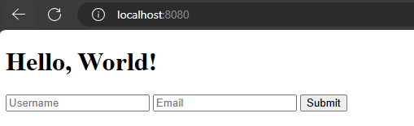
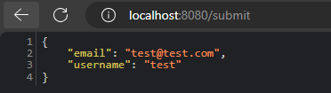
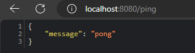

# Simple Gin Web Application

<br>
<b>This is a simple web application using the Gin web framework in Go.</b> 

* demonstrates handling GET and POST requests 
* serving HTML templates
* processing form submissions.


## Screenshots

## 1. screen



## 2. screen




## 3.screen



### Prerequisites

Before running this project, you need to have Go installed on your machine. You can download and install Go from [https://golang.org/dl/](https://golang.org/dl/).

Or the <b>most simpliest way if you install Scoop (Windows) package manager and install it from there (it will be added to your PATH automatically)</b>

1. Open Powershell and from the PS C:\> prompt, run
```powershell
Set-ExecutionPolicy -ExecutionPolicy RemoteSigned -Scope CurrentUser
Invoke-RestMethod -Uri https://get.scoop.sh | Invoke-Expression
```
2. Install Go
```bash
scoop install go
```


### Installing

To get the project running, follow these steps:

1. Clone the repository to your local machine:

```bash
git clone https://github.com/csabika98/go-gin-simple-example.git
```

2. Navigate to the project directory:

```bash
cd path/to/the/project/dir
```

3. Run the application:

```bash
go run .
```

The server will start running on `localhost:8080`.

### Usage

- Access the main page by navigating to [`http://localhost:8080/`](command:_github.copilot.openSymbolFromReferences?%5B%7B%22%24mid%22%3A1%2C%22path%22%3A%22%2FC%3A%2FUsers%2FDEV%2FDesktop%2FProjects%2Fgo-gin-wip%2Froutes.go%22%2C%22scheme%22%3A%22file%22%7D%2C%7B%22line%22%3A3%2C%22character%22%3A1%7D%5D "routes.go") in your web browser. You will be greeted with a simple web page.
- The `/ping` route can be accessed by navigating to [`http://localhost:8080/ping`](command:_github.copilot.openSymbolFromReferences?%5B%7B%22%24mid%22%3A1%2C%22path%22%3A%22%2FC%3A%2FUsers%2FDEV%2FDesktop%2FProjects%2Fgo-gin-wip%2Froutes.go%22%2C%22scheme%22%3A%22file%22%7D%2C%7B%22line%22%3A3%2C%22character%22%3A1%7D%5D "routes.go"), which will return a JSON response `{"message":"pong"}`.
- To test form submission, navigate to the main page and use the form provided to submit a username and email. The server will respond with the submitted data in JSON format.

## Built With

* [Gin](https://github.com/gin-gonic/gin) - The web framework used

